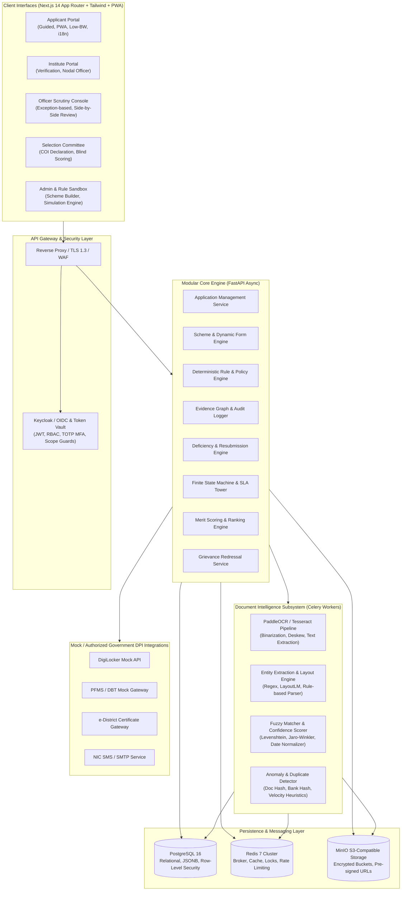
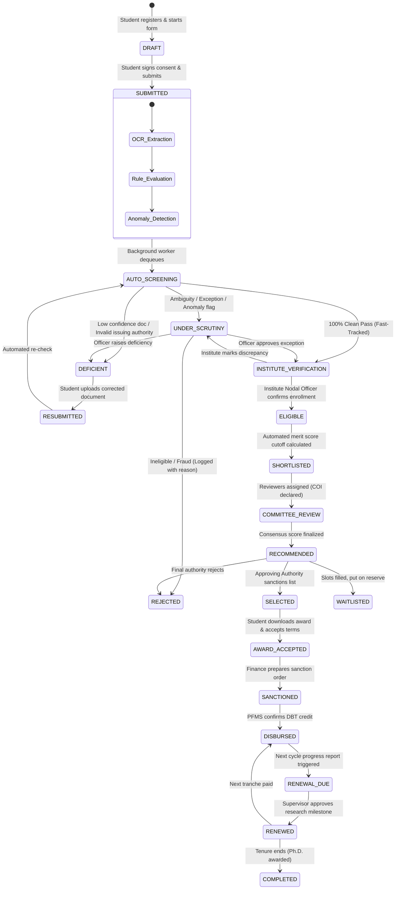

# SCHOLARSETU — MASTER ENGINEERING SPECIFICATION & BLUEPRINT
**Project:** SIH 2026 — SIH26239  
**Ministry:** Ministry of Tribal Affairs (MoTA)  
**Document:** Master Technical Architecture & Engineering Specification  
**Version:** 1.0.0  
**Status:** Approved for Implementation  

---

## 1. System Architecture & High-Level Design



---

## 2. Complete Database Architecture & PostgreSQL Schema (DDL)

```sql
-- ============================================================================
-- SCHOLARSETU: ENTERPRISE POSTGRESQL 16 PRODUCTION DDL
-- ============================================================================

CREATE EXTENSION IF NOT EXISTS "uuid-ossp";
CREATE EXTENSION IF NOT EXISTS "pgcrypto";

-- 1. USERS & ROLES
CREATE TYPE user_role AS ENUM (
    'APPLICANT', 
    'INSTITUTE_NODAL_OFFICER', 
    'UNIVERSITY_OFFICER', 
    'SCRUTINY_OFFICER', 
    'SCHEME_OFFICER', 
    'COMMITTEE_MEMBER', 
    'APPROVING_AUTHORITY', 
    'FINANCE_OFFICER', 
    'MINISTRY_LEADERSHIP', 
    'ADMINISTRATOR', 
    'AUDITOR'
);

CREATE TABLE users (
    id UUID PRIMARY KEY DEFAULT gen_random_uuid(),
    role user_role NOT NULL,
    full_name VARCHAR(150) NOT NULL,
    mobile VARCHAR(15) UNIQUE NOT NULL,
    email VARCHAR(255) UNIQUE,
    password_hash VARCHAR(255) NOT NULL,
    is_active BOOLEAN NOT NULL DEFAULT TRUE,
    is_mfa_enabled BOOLEAN NOT NULL DEFAULT FALSE,
    mfa_secret_token VARCHAR(255),
    last_login_at TIMESTAMPTZ,
    created_at TIMESTAMPTZ NOT NULL DEFAULT NOW(),
    updated_at TIMESTAMPTZ NOT NULL DEFAULT NOW()
);

-- 2. APPLICANT PROFILES
CREATE TABLE applicant_profiles (
    id UUID PRIMARY KEY DEFAULT gen_random_uuid(),
    user_id UUID UNIQUE NOT NULL REFERENCES users(id) ON DELETE RESTRICT,
    aadhaar_vault_token VARCHAR(128) UNIQUE, -- Tokenized identifier; no raw Aadhaar stored
    dob DATE NOT NULL,
    gender VARCHAR(20) NOT NULL,
    category VARCHAR(20) NOT NULL DEFAULT 'ST',
    sub_caste VARCHAR(100),
    father_or_guardian_name VARCHAR(150),
    mother_name VARCHAR(150),
    annual_family_income NUMERIC(12, 2) NOT NULL,
    is_pwpd BOOLEAN NOT NULL DEFAULT FALSE,
    pwpd_type VARCHAR(100),
    pwpd_percentage NUMERIC(5, 2),
    state_of_domicile VARCHAR(100) NOT NULL,
    district_of_domicile VARCHAR(100) NOT NULL,
    permanent_address TEXT NOT NULL,
    pincode VARCHAR(10) NOT NULL,
    bank_account_hash VARCHAR(64) NOT NULL, -- SHA-256 for duplicate detection
    bank_ifsc VARCHAR(11) NOT NULL,
    bank_name VARCHAR(150) NOT NULL,
    consent_dpdp_timestamp TIMESTAMPTZ NOT NULL DEFAULT NOW(),
    consent_version VARCHAR(20) NOT NULL DEFAULT 'v2026.1',
    created_at TIMESTAMPTZ NOT NULL DEFAULT NOW(),
    updated_at TIMESTAMPTZ NOT NULL DEFAULT NOW()
);
CREATE INDEX idx_applicant_profiles_state_district ON applicant_profiles(state_of_domicile, district_of_domicile);
CREATE INDEX idx_applicant_bank_hash ON applicant_profiles(bank_account_hash);

-- 3. INSTITUTES & UNIVERSITIES MASTER
CREATE TABLE institutes (
    id UUID PRIMARY KEY DEFAULT gen_random_uuid(),
    aishe_code VARCHAR(30) UNIQUE NOT NULL,
    name VARCHAR(255) NOT NULL,
    institute_type VARCHAR(50) NOT NULL, -- Central Univ, State Univ, IIT, NIT, Overseas
    state VARCHAR(100) NOT NULL,
    district VARCHAR(100) NOT NULL,
    nodal_officer_user_id UUID REFERENCES users(id),
    is_verified BOOLEAN NOT NULL DEFAULT TRUE,
    created_at TIMESTAMPTZ NOT NULL DEFAULT NOW()
);

-- 4. SCHEMES & SCHEME VERSIONS (Config-Driven)
CREATE TYPE scheme_status AS ENUM ('DRAFT', 'ACTIVE', 'ARCHIVED');

CREATE TABLE schemes (
    id UUID PRIMARY KEY DEFAULT gen_random_uuid(),
    code VARCHAR(30) UNIQUE NOT NULL, -- NFST, NOS
    name VARCHAR(255) NOT NULL,
    short_description TEXT,
    created_at TIMESTAMPTZ NOT NULL DEFAULT NOW()
);

CREATE TABLE scheme_versions (
    id UUID PRIMARY KEY DEFAULT gen_random_uuid(),
    scheme_id UUID NOT NULL REFERENCES schemes(id) ON DELETE RESTRICT,
    version_tag VARCHAR(30) NOT NULL, -- e.g. '2026.1'
    status scheme_status NOT NULL DEFAULT 'DRAFT',
    effective_from DATE NOT NULL,
    effective_to DATE,
    form_schema JSONB NOT NULL,       -- Dynamic form fields, sections, conditional logic
    document_schema JSONB NOT NULL,   -- Required document specs, formats, limits
    rule_schema JSONB NOT NULL,       -- Executable JSON rules
    scoring_schema JSONB NOT NULL,    -- Deterministic scoring weights and criteria
    workflow_sla_hours JSONB NOT NULL,-- SLA thresholds per stage
    approved_by UUID REFERENCES users(id),
    approved_at TIMESTAMPTZ,
    created_at TIMESTAMPTZ NOT NULL DEFAULT NOW(),
    CONSTRAINT uq_scheme_version UNIQUE (scheme_id, version_tag)
);

CREATE TABLE scheme_cycles (
    id UUID PRIMARY KEY DEFAULT gen_random_uuid(),
    scheme_version_id UUID NOT NULL REFERENCES scheme_versions(id),
    financial_year VARCHAR(10) NOT NULL, -- '2026-2027'
    application_start_date TIMESTAMPTZ NOT NULL,
    application_end_date TIMESTAMPTZ NOT NULL,
    total_slots INT NOT NULL DEFAULT 750,
    is_active BOOLEAN NOT NULL DEFAULT TRUE,
    created_at TIMESTAMPTZ NOT NULL DEFAULT NOW()
);

-- 5. APPLICATIONS & FINITE STATE MACHINE
CREATE TYPE application_status AS ENUM (
    'DRAFT',
    'SUBMITTED',
    'AUTO_SCREENING',
    'DEFICIENT',
    'RESUBMITTED',
    'UNDER_SCRUTINY',
    'INSTITUTE_VERIFICATION',
    'ELIGIBLE',
    'SHORTLISTED',
    'COMMITTEE_REVIEW',
    'RECOMMENDED',
    'SELECTED',
    'WAITLISTED',
    'REJECTED',
    'AWARD_ACCEPTED',
    'SANCTIONED',
    'DISBURSED',
    'RENEWAL_DUE',
    'RENEWED',
    'COMPLETED',
    'TERMINATED'
);

CREATE TABLE applications (
    id UUID PRIMARY KEY DEFAULT gen_random_uuid(),
    application_number VARCHAR(64) UNIQUE NOT NULL, -- NFST-2026-000124
    applicant_id UUID NOT NULL REFERENCES applicant_profiles(id) ON DELETE RESTRICT,
    scheme_cycle_id UUID NOT NULL REFERENCES scheme_cycles(id) ON DELETE RESTRICT,
    institute_id UUID REFERENCES institutes(id),
    status application_status NOT NULL DEFAULT 'DRAFT',
    current_stage VARCHAR(64) NOT NULL DEFAULT 'REGISTRATION',
    dynamic_form_data JSONB NOT NULL DEFAULT '{}'::jsonb,
    calculated_merit_score NUMERIC(6, 2) DEFAULT 0.00,
    overall_merit_rank INT,
    category_rank INT,
    fast_tracked BOOLEAN NOT NULL DEFAULT FALSE,
    submitted_at TIMESTAMPTZ,
    last_action_at TIMESTAMPTZ NOT NULL DEFAULT NOW(),
    stage_deadline_at TIMESTAMPTZ,
    created_at TIMESTAMPTZ NOT NULL DEFAULT NOW(),
    updated_at TIMESTAMPTZ NOT NULL DEFAULT NOW()
);
CREATE INDEX idx_apps_status_cycle ON applications(status, scheme_cycle_id);
CREATE INDEX idx_apps_institute ON applications(institute_id);

-- 6. DOCUMENTS & INTEL ENGINE
CREATE TYPE doc_verification_status AS ENUM (
    'PENDING', 
    'AUTO_VERIFIED', 
    'REQUIRES_HUMAN_REVIEW', 
    'DEFICIENT', 
    'REJECTED'
);

CREATE TABLE application_documents (
    id UUID PRIMARY KEY DEFAULT gen_random_uuid(),
    application_id UUID NOT NULL REFERENCES applications(id) ON DELETE CASCADE,
    document_type VARCHAR(64) NOT NULL, -- ST_CERTIFICATE, INCOME_CERTIFICATE, MARKSHEET, ADMISSION_LETTER
    original_filename VARCHAR(255) NOT NULL,
    storage_path VARCHAR(512) NOT NULL, -- MinIO S3 Object Key
    file_size_bytes INT NOT NULL,
    mime_type VARCHAR(64) NOT NULL,
    sha256_hash VARCHAR(64) NOT NULL,   -- Cryptographic duplicate & tamper check
    source VARCHAR(32) NOT NULL DEFAULT 'MANUAL_UPLOAD', -- 'DIGILOCKER', 'MANUAL_UPLOAD'
    verification_status doc_verification_status NOT NULL DEFAULT 'PENDING',
    is_active BOOLEAN NOT NULL DEFAULT TRUE, -- false if replaced via deficiency resubmission
    uploaded_at TIMESTAMPTZ NOT NULL DEFAULT NOW()
);
CREATE INDEX idx_doc_sha256 ON application_documents(sha256_hash);

-- 7. AI EXTRACTIONS & ANOMALIES
CREATE TABLE document_extractions (
    id UUID PRIMARY KEY DEFAULT gen_random_uuid(),
    document_id UUID NOT NULL REFERENCES application_documents(id) ON DELETE CASCADE,
    model_version VARCHAR(64) NOT NULL, -- e.g. 'PaddleOCR-v4.1.2 + MotA-ST-NER-v1'
    extracted_fields JSONB NOT NULL,    -- {"name": "Rahul Kumar", "cert_no": "ST-9912", "income": 120000}
    field_confidences JSONB NOT NULL,   -- {"name": 0.98, "cert_no": 0.99, "income": 0.74}
    average_confidence NUMERIC(5, 4) NOT NULL,
    processing_time_ms INT NOT NULL,
    raw_ocr_text TEXT,
    created_at TIMESTAMPTZ NOT NULL DEFAULT NOW()
);

CREATE TABLE anomaly_flags (
    id UUID PRIMARY KEY DEFAULT gen_random_uuid(),
    application_id UUID NOT NULL REFERENCES applications(id) ON DELETE CASCADE,
    document_id UUID REFERENCES application_documents(id),
    flag_type VARCHAR(64) NOT NULL,     -- DUPLICATE_DOC_HASH, REUSED_BANK_ACCOUNT, NAME_MISMATCH, SUSPICIOUS_BATCH
    severity VARCHAR(20) NOT NULL,      -- LOW, MEDIUM, CRITICAL
    description TEXT NOT NULL,
    evidence_payload JSONB NOT NULL,
    is_resolved BOOLEAN NOT NULL DEFAULT FALSE,
    resolved_by UUID REFERENCES users(id),
    resolved_at TIMESTAMPTZ,
    created_at TIMESTAMPTZ NOT NULL DEFAULT NOW()
);

-- 8. RULE EXECUTION LOGS & EVIDENCE GRAPH
CREATE TYPE rule_check_result AS ENUM ('PASS', 'FAIL', 'HUMAN_REVIEW');

CREATE TABLE rule_evaluations (
    id UUID PRIMARY KEY DEFAULT gen_random_uuid(),
    application_id UUID NOT NULL REFERENCES applications(id) ON DELETE CASCADE,
    rule_id VARCHAR(64) NOT NULL,       -- NFST-R-001
    rule_version VARCHAR(32) NOT NULL,  -- 2026.1.4
    rule_type VARCHAR(32) NOT NULL,     -- ELIGIBILITY, DOCUMENT, SCORING
    result rule_check_result NOT NULL,
    reason_code VARCHAR(64) NOT NULL,
    explanation TEXT NOT NULL,
    evidence_document_id UUID REFERENCES application_documents(id),
    extracted_value TEXT,
    expected_value TEXT,
    confidence NUMERIC(5, 4),
    evaluated_at TIMESTAMPTZ NOT NULL DEFAULT NOW()
);
CREATE INDEX idx_rule_eval_app ON rule_evaluations(application_id);

-- 9. DEFICIENCIES & RESUBMISSIONS
CREATE TYPE deficiency_status AS ENUM ('ISSUED', 'RESUBMITTED', 'RESOLVED', 'EXPIRED', 'REJECTED');

CREATE TABLE deficiencies (
    id UUID PRIMARY KEY DEFAULT gen_random_uuid(),
    application_id UUID NOT NULL REFERENCES applications(id) ON DELETE CASCADE,
    document_id UUID REFERENCES application_documents(id),
    rule_id VARCHAR(64),
    reason_code VARCHAR(64) NOT NULL,  -- e.g. 'INCOME_CERT_AUTHORITY_INVALID'
    public_explanation TEXT NOT NULL,  -- "Your income certificate was not issued by SDO/Tehsildar."
    action_required TEXT NOT NULL,     -- "Upload certificate signed by an authorized Revenue Officer."
    deadline_at TIMESTAMPTZ NOT NULL,
    status deficiency_status NOT NULL DEFAULT 'ISSUED',
    issued_by UUID REFERENCES users(id), -- NULL if auto-generated by Rule Engine
    resubmitted_document_id UUID REFERENCES application_documents(id),
    resolved_at TIMESTAMPTZ,
    created_at TIMESTAMPTZ NOT NULL DEFAULT NOW(),
    updated_at TIMESTAMPTZ NOT NULL DEFAULT NOW()
);

-- 10. SELECTION COMMITTEE EVALUATION
CREATE TABLE committee_reviews (
    id UUID PRIMARY KEY DEFAULT gen_random_uuid(),
    application_id UUID NOT NULL REFERENCES applications(id) ON DELETE RESTRICT,
    reviewer_user_id UUID NOT NULL REFERENCES users(id) ON DELETE RESTRICT,
    has_conflict_of_interest BOOLEAN NOT NULL DEFAULT FALSE,
    coi_declaration_signed_at TIMESTAMPTZ,
    score_academic_merit NUMERIC(5, 2) DEFAULT 0.00,
    score_research_proposal NUMERIC(5, 2) DEFAULT 0.00,
    score_interview NUMERIC(5, 2) DEFAULT 0.00,
    total_awarded_score NUMERIC(5, 2) DEFAULT 0.00,
    recommendation VARCHAR(32), -- 'RECOMMENDED', 'NOT_RECOMMENDED', 'HOLD'
    remarks TEXT,
    reviewed_at TIMESTAMPTZ,
    CONSTRAINT uq_committee_app_reviewer UNIQUE (application_id, reviewer_user_id)
);

-- 11. PAYMENTS & DBT LIFECYCLE
CREATE TYPE payment_status AS ENUM ('PENDING_SANCTION', 'SANCTIONED', 'PFMS_TRANSMITTED', 'SUCCESS', 'FAILED', 'RECONCILED');

CREATE TABLE payment_disbursements (
    id UUID PRIMARY KEY DEFAULT gen_random_uuid(),
    application_id UUID NOT NULL REFERENCES applications(id) ON DELETE RESTRICT,
    disbursement_cycle INT NOT NULL DEFAULT 1, -- Quarter / Installment 1, 2, 3
    sanction_order_number VARCHAR(100) NOT NULL,
    amount NUMERIC(10, 2) NOT NULL,
    pfms_transaction_id VARCHAR(100),
    payment_status payment_status NOT NULL DEFAULT 'PENDING_SANCTION',
    failure_reason TEXT,
    sanctioned_at TIMESTAMPTZ,
    disbursed_at TIMESTAMPTZ,
    created_at TIMESTAMPTZ NOT NULL DEFAULT NOW()
);

-- 12. IMMUTABLE AUDIT LOGS (Case Replay Foundation)
CREATE TABLE audit_logs (
    id UUID PRIMARY KEY DEFAULT gen_random_uuid(),
    actor_id UUID REFERENCES users(id),
    actor_role VARCHAR(64) NOT NULL,
    action VARCHAR(100) NOT NULL,       -- 'DEFICIENCY_RAISED', 'RULE_EVALUATED', 'STATUS_TRANSITION'
    entity_name VARCHAR(64) NOT NULL,   -- 'applications', 'deficiencies', 'scheme_versions'
    entity_id VARCHAR(64) NOT NULL,
    before_state JSONB,
    after_state JSONB,
    reason_code TEXT,
    ip_address VARCHAR(45),
    user_agent TEXT,
    created_at TIMESTAMPTZ NOT NULL DEFAULT NOW()
);
CREATE INDEX idx_audit_entity ON audit_logs(entity_name, entity_id);
CREATE INDEX idx_audit_created_at ON audit_logs(created_at DESC);
```

---

## 3. Comprehensive RESTful API Specification (FastAPI / OpenAPI)

### 3.1 Authentication & Profile
- `POST /api/v1/auth/register-otp`
  - Body: `{"mobile": "9876543210", "role": "APPLICANT"}`
  - Resp: `{"status": "OTP_SENT", "txn_id": "tx_abc123"}`
- `POST /api/v1/auth/verify-otp`
  - Body: `{"mobile": "9876543210", "otp": "452109", "txn_id": "tx_abc123"}`
  - Resp: `{"access_token": "jwt...", "refresh_token": "...", "user": {...}}`
- `GET /api/v1/applicant/profile`
  - Auth: `Bearer APPLICANT`
  - Resp: Full tokenized profile, DigiLocker status, bank verification status.
- `PUT /api/v1/applicant/profile`
  - Updates profile with DPDP consent timestamp and version signature.

### 3.2 Schemes & Eligibility Self-Check
- `GET /api/v1/schemes`
  - Returns open schemes (NFST, NOS) with eligibility criteria, guidelines, and deadlines.
- `POST /api/v1/schemes/{scheme_code}/self-check`
  - Evaluates pre-application responses without creating a draft application.
  - Body: `{"st_category": true, "family_income": 450000, "age": 28, "degree_enrolled": "PhD"}`
  - Resp:
    ```json
    {
      "is_likely_eligible": true,
      "scheme_code": "NFST",
      "satisfied_rules": ["R01_ST_CATEGORY", "R02_MAX_AGE_36", "R03_INCOME_CEILING"],
      "unmet_rules": [],
      "explanation": "You satisfy all pre-requisite conditions for National Fellowship for ST 2026-27."
    }
    ```

### 3.3 Dynamic Application & Document Management
- `POST /api/v1/applications`
  - Starts draft application with version lock to latest approved `scheme_version_id`.
- `GET /api/v1/applications/{app_id}`
  - Retrieves application state, dynamic fields, and uploaded document registry.
- `POST /api/v1/applications/{app_id}/documents/upload`
  - Multipart file upload: document_type, file binary.
  - Returns document ID and enqueues Celery task `tasks.process_document_ai`.
- `POST /api/v1/applications/{app_id}/submit`
  - Validates all mandatory sections and triggers the automated screening engine.

### 3.4 Scrutiny, Exceptions & Deficiency
- `GET /api/v1/officer/scrutiny/queue?priority=CRITICAL_SLA&stage=UNDER_SCRUTINY`
  - Retrieves prioritized exception queue sorted by SLA deadline and anomaly severity.
- `GET /api/v1/officer/scrutiny/{app_id}/case-file`
  - Full side-by-side view payload: Applicant form, Document URLs, OCR Extractions, Rule Results, and Anomaly flags.
- `POST /api/v1/officer/scrutiny/{app_id}/raise-deficiency`
  - Body: `{"document_id": "...", "reason_code": "INCOME_CERT_AUTHORITY_INVALID", "deadline_days": 5, "notes": "..."}`
- `POST /api/v1/applicant/applications/{app_id}/deficiencies/{def_id}/resubmit`
  - Uploads corrected document and triggers automated re-screening.
- `POST /api/v1/officer/scrutiny/{app_id}/decision`
  - Body: `{"action": "APPROVE_ELIGIBLE", "remarks": "Documents re-checked and valid"}`

### 3.5 Selection, Ranking & Simulation
- `POST /api/v1/selection/calculate-merit-ranks`
  - Executes deterministic merit scoring algorithm for shortlisted candidates.
- `POST /api/v1/admin/rules/simulate`
  - Simulates proposed rule changes on historical/current applications.
  - Body:
    ```json
    {
      "scheme_code": "NFST",
      "proposed_rule_overrides": [
        {"rule_id": "NFST-R-003", "field": "annual_family_income", "operator": "<=", "value": 800000}
      ]
    }
    ```
  - Resp:
    ```json
    {
      "total_cohort_evaluated": 12480,
      "currently_eligible": 7842,
      "simulated_eligible": 8614,
      "net_impact": 772,
      "demographic_distribution": {"male": 4400, "female": 4214},
      "state_breakdown": {"Odisha": "+140", "Jharkhand": "+185", "Madhya Pradesh": "+210"}
    }
    ```

---

## 4. NFST & NOS Rule Engine JSON Schema

### 4.1 JSON Schema Definition
```json
{
  "$schema": "https://json-schema.org/draft/2020-12/schema",
  "title": "ScholarSetuRuleSet",
  "type": "object",
  "required": ["scheme_code", "version", "rules"],
  "properties": {
    "scheme_code": { "type": "string" },
    "version": { "type": "string" },
    "effective_from": { "type": "string", "format": "date" },
    "rules": {
      "type": "array",
      "items": {
        "type": "object",
        "required": ["rule_id", "rule_type", "field_source", "operator", "expected_value", "on_fail_action"],
        "properties": {
          "rule_id": { "type": "string" },
          "name": { "type": "string" },
          "rule_type": { "enum": ["ELIGIBILITY", "DOCUMENT", "SCORING", "WORKFLOW"] },
          "field_source": { "type": "string" },
          "operator": { "enum": ["EQUALS", "IN", "LESS_THAN_OR_EQUAL", "GREATER_THAN_OR_EQUAL", "REGEX_MATCH", "FUZZY_MATCH_GTE"] },
          "expected_value": {},
          "threshold": { "type": "number" },
          "on_fail_action": { "enum": ["AUTO_DEFICIENCY", "ROUTE_TO_HUMAN_REVIEW", "INELIGIBLE_FLAG"] },
          "reason_code": { "type": "string" },
          "public_explanation": { "type": "string" }
        }
      }
    }
  }
}
```

### 4.2 Concrete NFST Rule Set (`NFST-2026.1.json`)
```json
{
  "scheme_code": "NFST",
  "version": "2026.1",
  "effective_from": "2026-04-01",
  "rules": [
    {
      "rule_id": "NFST-R-001",
      "name": "Mandatory ST Caste Status",
      "rule_type": "ELIGIBILITY",
      "field_source": "document_extractions.ST_CERTIFICATE.category",
      "operator": "EQUALS",
      "expected_value": "SCHEDULED_TRIBE",
      "on_fail_action": "ROUTE_TO_HUMAN_REVIEW",
      "reason_code": "ST_STATUS_UNCONFIRMED",
      "public_explanation": "Applicant category does not explicitly confirm Scheduled Tribe status on document."
    },
    {
      "rule_id": "NFST-R-002",
      "name": "Applicant Name Cross-Verification",
      "rule_type": "DOCUMENT",
      "field_source": "document_extractions.ST_CERTIFICATE.candidate_name",
      "operator": "FUZZY_MATCH_GTE",
      "expected_value": "applications.dynamic_form_data.full_name",
      "threshold": 0.85,
      "on_fail_action": "ROUTE_TO_HUMAN_REVIEW",
      "reason_code": "NAME_FUZZY_CONFIDENCE_LOW",
      "public_explanation": "The name on the certificate differs from the name submitted in the application."
    },
    {
      "rule_id": "NFST-R-003",
      "name": "Maximum Age Threshold (36 Years for ST)",
      "rule_type": "ELIGIBILITY",
      "field_source": "applicant_profiles.dob",
      "operator": "GREATER_THAN_OR_EQUAL",
      "expected_value": "1990-04-01",
      "on_fail_action": "INELIGIBLE_FLAG",
      "reason_code": "AGE_EXCEEDS_SCHEME_LIMIT",
      "public_explanation": "Age exceeds the 36-year upper limit applicable for NFST candidates."
    },
    {
      "rule_id": "NFST-R-004",
      "name": "Income Ceiling Requirement",
      "rule_type": "ELIGIBILITY",
      "field_source": "applicant_profiles.annual_family_income",
      "operator": "LESS_THAN_OR_EQUAL",
      "expected_value": 600000.00,
      "on_fail_action": "ROUTE_TO_HUMAN_REVIEW",
      "reason_code": "INCOME_EXCEEDS_CEILING",
      "public_explanation": "Annual family income declared exceeds the ceiling of ₹6,00,000 per annum."
    },
    {
      "rule_id": "NFST-R-005",
      "name": "Regular M.Phil/Ph.D Enrollment",
      "rule_type": "ELIGIBILITY",
      "field_source": "applications.dynamic_form_data.course_type",
      "operator": "IN",
      "expected_value": ["PHD_REGULAR", "MPHIL_REGULAR", "INTEGRATED_PHD"],
      "on_fail_action": "INELIGIBLE_FLAG",
      "reason_code": "COURSE_NOT_APPROVED",
      "public_explanation": "Only candidates admitted into regular, full-time M.Phil or Ph.D programs are eligible."
    }
  ]
}
```

### 4.3 Concrete NOS Rule Set (`NOS-2026.1.json`)
```json
{
  "scheme_code": "NOS",
  "version": "2026.1",
  "effective_from": "2026-04-01",
  "rules": [
    {
      "rule_id": "NOS-R-001",
      "name": "ST Category Verification",
      "rule_type": "ELIGIBILITY",
      "field_source": "document_extractions.ST_CERTIFICATE.category",
      "operator": "EQUALS",
      "expected_value": "SCHEDULED_TRIBE",
      "on_fail_action": "ROUTE_TO_HUMAN_REVIEW",
      "reason_code": "ST_STATUS_UNCONFIRMED",
      "public_explanation": "Candidate ST status not confirmed."
    },
    {
      "rule_id": "NOS-R-002",
      "name": "Family Income Ceiling (₹8.0 Lakhs)",
      "rule_type": "ELIGIBILITY",
      "field_source": "applicant_profiles.annual_family_income",
      "operator": "LESS_THAN_OR_EQUAL",
      "expected_value": 800000.00,
      "on_fail_action": "ROUTE_TO_HUMAN_REVIEW",
      "reason_code": "NOS_INCOME_CEILING_EXCEEDED",
      "public_explanation": "Annual family income exceeds the limit of ₹8,00,000 for National Overseas Scholarship."
    },
    {
      "rule_id": "NOS-R-003",
      "name": "Minimum Qualifying Degree Marks (55%)",
      "rule_type": "ELIGIBILITY",
      "field_source": "applications.dynamic_form_data.undergraduate_percentage",
      "operator": "GREATER_THAN_OR_EQUAL",
      "expected_value": 55.00,
      "on_fail_action": "INELIGIBLE_FLAG",
      "reason_code": "MIN_ACADEMIC_PERCENTAGE_NOT_MET",
      "public_explanation": "Candidate must secure at least 55% marks or equivalent grade in the qualifying degree."
    },
    {
      "rule_id": "NOS-R-004",
      "name": "QS World University Ranking Threshold",
      "rule_type": "ELIGIBILITY",
      "field_source": "applications.dynamic_form_data.foreign_university_qs_rank",
      "operator": "LESS_THAN_OR_EQUAL",
      "expected_value": 500,
      "on_fail_action": "ROUTE_TO_HUMAN_REVIEW",
      "reason_code": "QS_RANK_EXCEEDS_500",
      "public_explanation": "Admission must be in an overseas institution ranked within the top 500 in QS World Rankings."
    },
    {
      "rule_id": "NOS-R-005",
      "name": "Valid Unconditional Offer Letter",
      "rule_type": "DOCUMENT",
      "field_source": "document_extractions.ADMISSION_OFFER.offer_type",
      "operator": "EQUALS",
      "expected_value": "UNCONDITIONAL",
      "on_fail_action": "AUTO_DEFICIENCY",
      "reason_code": "CONDITIONAL_OFFER_NOT_ACCEPTED",
      "public_explanation": "An unconditional admission offer letter from the foreign university is mandatory."
    }
  ]
}
```

---

## 5. Complete Application State Machine Specification



### State Transition Guard & Action Matrix
| Current State | Next State | Trigger Event | Authorized Actor | Automated Guards & Pre-conditions | Audit Event |
| :--- | :--- | :--- | :--- | :--- | :--- |
| `DRAFT` | `SUBMITTED` | Form Submit | Applicant | All mandatory fields populated, documents hashed, DPDP consent signed | `APP_SUBMITTED` |
| `SUBMITTED` | `AUTO_SCREENING` | Job Dequeue | System Worker | Worker locks application row via Redis distributed lock | `SCREENING_STARTED` |
| `AUTO_SCREENING` | `DEFICIENT` | Auto-Rule Fail | System Worker | Rule fail marked `AUTO_DEFICIENCY`; deficiency record created with 5-day deadline | `DEFICIENCY_AUTO_ISSUED` |
| `AUTO_SCREENING` | `INST_VERIF` | Clean Pass | System Worker | All rules PASS, doc confidence >= 0.95, zero anomalies, fast-track flag set | `APP_FAST_TRACKED` |
| `AUTO_SCREENING` | `UNDER_SCRUTINY` | Rule Exception | System Worker | Confidence < 0.85 or anomaly detected or rule `ROUTE_TO_HUMAN_REVIEW` | `EXCEPTION_ROUTED` |
| `DEFICIENT` | `RESUBMITTED` | Doc Re-upload | Applicant | File uploaded before `deadline_at`, SHA-256 differs from rejected doc | `DEFICIENCY_RESUBMITTED` |
| `UNDER_SCRUTINY` | `DEFICIENT` | Manual Defic. | Scrutiny Officer | Officer specifies reason code, detailed remarks, and replacement deadline | `DEFICIENCY_MANUAL_ISSUED` |
| `UNDER_SCRUTINY` | `INST_VERIF` | Manual Approve | Scrutiny Officer | Officer overrides with justification comment; audit record captured | `SCRUTINY_APPROVED` |
| `INST_VERIF` | `ELIGIBLE` | Verify Academics | Institute Officer | AISHE code matches, student enrollment roll verified in university DB | `INSTITUTE_VERIFIED` |
| `ELIGIBLE` | `SHORTLISTED` | Merit Batch Run | Scheme Officer | Application score exceeds provisional slot cutoff | `SHORTLIST_GENERATED` |
| `COMMITTEE_REV` | `RECOMMENDED` | Scoring Complete | Committee Member | Conflict of Interest declared FALSE, rubric scores recorded | `COMMITTEE_SCORED` |
| `RECOMMENDED` | `SELECTED` | Final Sanction | Approving Auth. | Digital signature applied, final award list published | `SELECTION_SANCTIONED` |
| `SELECTED` | `DISBURSED` | PFMS Ack | Finance System | DBT transaction ID received from PFMS gateway | `PAYMENT_DISBURSED` |

---

## 6. AI & Document Intelligence Pipeline Architecture

```
[Uploaded Document: ST Certificate / Income / Marksheet]
                          │
                          ▼
            [1. MIME & Security Anti-Malware Scan]
                          │
                          ▼
            [2. Image Pre-processing & Deskew]
    (OpenCV: Grayscale -> Otsu Thresholding -> Deskew)
                          │
                          ▼
         [3. Document Classification (PaddleOCR)]
  (Confidence threshold >= 0.90; classifies cert type)
                          │
                          ▼
           [4. Optical Character Recognition (OCR)]
 (Extracts raw layout blocks, bounding boxes, text lines)
                          │
                          ▼
           [5. Regex & Named Entity Extraction (NER)]
  - Candidate Name
  - Certificate Registration Number
  - Issuing Authority (Tehsildar/SDM/District Magistrate)
  - Issue Date
  - Caste/Category ("Scheduled Tribe")
  - Declared Annual Income (Numbers & Words)
                          │
                          ▼
               [6. Fuzzy Cross-Validation]
  - Name vs Profile Name: Levenshtein Distance & Token Sort
  - DOB vs Profile DOB: ISO 8601 Date Parsing
  - Issuing Authority vs State Revenue Master List
                          │
                          ▼
         [7. Anomaly & Duplicate Detection Engine]
  - Document SHA-256 Hash check against entire database
  - Same Bank Account Hash across multiple applicants
  - Bulk upload timing anomalies
                          │
                          ▼
         [8. Confidence Aggregation & Decision Router]
     ┌────────────────────┬────────────────────┐
     ▼                    ▼                    ▼
[>= 95% Confidence] [80% - 94% Review]    [< 80% or Mismatch]
[All Rules Clean]   [Confidence Flag]    [Critical Defect]
     │                    │                    │
     ▼                    ▼                    ▼
[Fast-Track: Inst]   [Human Scrutiny]    [Auto-Deficiency]
```

### Confidence & Mismatch Calibration Matrix
| Extraction Field | Matching Algorithm | High Confidence (>= 0.95) | Review Needed (0.80 - 0.94) | Rejection / Deficiency (< 0.80) |
| :--- | :--- | :--- | :--- | :--- |
| **Candidate Name** | Token Sort Ratio + Levenshtein | Score >= 95% (Exact / Minor space) | 80% <= Score < 95% (Middle name diff) | Score < 80% (Different person name) |
| **Category** | Exact Keyword Match | Contains "Scheduled Tribe" or "ST" | Regional synonym ("Adivasi", "Janajati") | Missing ST classification |
| **Issuing Authority** | Master List Fuzzy Match | Authority matches approved revenue list | Authority recognized but unusual title | Missing issuing authority signature |
| **Annual Income** | Digit + Word Extraction | Digits equal and <= ceiling | Number clear but word stamp blurred | Income exceeds scheme threshold |
| **Certificate Date** | Date Range Validation | Valid date within validity period | Date valid, near renewal threshold | Certificate expired or issue date future |

---

## 7. UI / UX Screen-by-Screen Specification

### 7.1 Applicant Portal
1. **Welcome & Scheme Discovery (`/schemes`)**
   - Clean, high-contrast, bilingual cards (NFST, NOS).
   - "Check Likely Eligibility in 60 Seconds" modal.
   - Live application counters: Application Deadline countdown, total slots.
2. **Dynamic Multi-Step Application Form (`/apply/[scheme_code]`)**
   - Form generated dynamically from `scheme_versions.form_schema`.
   - **Step 1: Personal & Category Details** (Pre-filled from profile).
   - **Step 2: Academic & Admission Information** (AISHE dropdown, enrollment details).
   - **Step 3: Document Upload with Instant AI Pre-check**:
     - As student uploads ST Certificate, client compresses image (< 500KB) for low-bandwidth.
     - Within 3 seconds: Visual badge: "✓ Verified ST Certificate Detected (Confidence: 98%)".
     - In case of mismatch: Amber prompt: "The name on the certificate appears as 'Rahul K.' while your profile is 'Rahul Kumar'. An officer will review this."
   - **Step 4: Review, DPDP Consent & Submit**.
3. **Applicant Lifecycle Dashboard (`/applicant/dashboard`)**
   - Visual progress timeline: `Submitted -> AI Screening -> Scrutiny -> Institute -> Selection -> Payment`.
   - Active Deficiencies alert box with countdown: "Action Required: Replace Income Certificate. 3 days remaining."
   - One-click file replacement modal.

### 7.2 Officer Scrutiny Console
1. **Prioritized Queue (`/officer/scrutiny`)**
   - Tabbed queues: `Critical SLA (< 24h)` (18), `High Priority` (42), `Normal` (156), `AI Flagged Mismatch` (27).
   - Quick filters: Scheme (NFST/NOS), State, Institution.
2. **Side-by-Side Case Review Workspace (`/officer/scrutiny/[app_id]`)**
   - **Left Panel (50% Width): High-Speed Document Viewer**
     - PDF / High-res image with zoom, pan, rotate, and inverted high-contrast mode.
     - Bounding-box overlays highlighting extracted fields (Name, Cert No, Date).
   - **Right Panel (50% Width): Data & Evidence Comparison**
     - Top Card: AI Case Summary (3 sentences, model version tag).
     - Field-by-field side-by-side comparison:
       - Application Name vs. Extracted Document Name (Fuzzy similarity score badge).
       - Extracted Income vs. Ceiling Rule.
     - Rule Evaluation List:
       - `[✓ PASS]` R-01 ST Category (Extracted: ST, Conf: 99%)
       - `[⚠ REVIEW]` R-02 Name Match (Similarity: 88%)
     - One-click Action Bar:
       - `[Approve & Pass to Institute]` (Green)
       - `[Issue Specific Deficiency]` (Amber - pre-populates public explanation)
       - `[Flag for Anomaly / Committee]` (Blue)
       - `[Reject with Reason Code]` (Red)

### 7.3 Selection Committee Review Screen
1. **Candidate Shortlist & Blind Evaluation (`/committee/evaluate/[app_id]`)**
   - Conflict of Interest (COI) gate modal: "I hereby confirm I have no personal, familial, or institutional conflict of interest regarding candidate #NFST-2026-000124."
   - Optional blind review mode: Applicant name and photo masked, showing only merit credentials, research proposal synopsis, and academic scores.
   - Structured Rubric Scoring inputs:
     - Academic Background (0 - 40)
     - Research Feasibility & Tribal Impact (0 - 30)
     - Publications / Prior Work (0 - 30)
   - Real-time committee consensus rank preview.

### 7.4 Admin Scheme & Rule Sandbox
1. **Visual Rule Builder & Version Controller (`/admin/schemes/[id]/rules`)**
   - Rule editor: Condition, Target field, Operator, Expected value, Failure action.
   - Version tag manager: Draft -> Test -> Published.
2. **Rule Impact Simulation Console (`/admin/simulation`)**
   - Side-by-side impact calculator:
     - Select Current Rule vs. Proposed Rule (e.g. changing income ceiling from 6.0L to 8.0L).
     - Click `[Run Simulation on 12,480 Cohort Applications]`.
     - Output: Sankey diagram & geographic heatmap showing net new eligible students (+772), budget impact (+₹3.4 Cr), and zero regression checks.

---

## 8. Development Backlog (Epics, Stories, Tasks & Implementation Matrix)

| Epic ID | Epic Name | Story / Task ID | Description | MVP Priority |
| :--- | :--- | :--- | :--- | :--- |
| **EP-01** | **Identity & Profile** | US-101 | Mobile OTP & Keycloak JWT authentication flow | **P0** |
| | | US-102 | Applicant Profile with Aadhaar tokenization & bank hash | **P0** |
| | | US-103 | DPDP 2025 consent logging with versioned disclaimer | **P0** |
| **EP-02** | **Scheme & Dynamic Forms**| US-201 | Scheme versions database model & JSON schema parser | **P0** |
| | | US-202 | Dynamic Form generator in React for NFST and NOS schemes | **P0** |
| | | US-203 | Self-check eligibility interactive calculator | **P0** |
| **EP-03** | **Doc AI Subsystem** | US-301 | MinIO S3 document upload handler & SHA-256 duplicate hasher | **P0** |
| | | US-302 | Celery OCR worker with PaddleOCR / Tesseract pipeline | **P0** |
| | | US-303 | Regex & NER entity extractor for ST, Income & Marks | **P0** |
| | | US-304 | Fuzzy matching engine for name & DOB cross-validation | **P0** |
| **EP-04** | **Rule & Evidence Engine**| US-401 | Deterministic JSON rule evaluator with reason codes | **P0** |
| | | US-402 | Evidence graph generator linking extracted fields to rules | **P0** |
| | | US-403 | Case Replay auditor timeline endpoint | **P0** |
| **EP-05** | **Workflow & Scrutiny** | US-501 | Finite State Machine transitions with guard conditions | **P0** |
| | | US-502 | Officer side-by-side scrutiny console with PDF annotations | **P0** |
| | | US-503 | Itemized deficiency generator and resubmission handler | **P0** |
| | | US-504 | SLA Control Tower with 70% / 90% / 100% breach alerts | **P0** |
| **EP-06** | **Selection & Scoring** | US-601 | Deterministic merit score calculator and ranking engine | **P0** |
| | | US-602 | Committee conflict of interest declaration & scoring modal | **P1** |
| | | US-603 | Selection list publication & award letter generator | **P0** |
| **EP-07** | **Simulation & Admin** | US-701 | Admin policy rule editor with JSON validator | **P0** |
| | | US-702 | Cohort policy simulation engine with difference report | **P0** |
| **EP-08** | **Mock Integrations** | US-801 | Mock DigiLocker URI resolver | **P1** |
| | | US-802 | Mock PFMS DBT disbursement gateway with transaction IDs | **P1** |
| | | US-803 | Mock e-District certificate verification mock service | **P1** |

---

## 9. Winning 5-Minute SIH Presentation & Live Demo Script

### Pitch Narrative
> *"Respected Jury Members, India awards over ₹1,500 Crores annually in Scheduled Tribe scholarships and fellowships. Yet, tribal students spend months facing repeated, opaque document deficiencies, while officers manually scrutinize thousands of pristine applications. ScholarSetu changes the paradigm: We do not replace government decision-makers with a black-box AI. Instead, our architecture is: **AI extracts evidence, Rules evaluate policy, Officers resolve exceptions, and Leaders hold total visibility.**"*

### Minute-by-Minute Live Demo Flow

#### Minute 0:00 - 1:00 | The Student Experience & Dynamic Form (Scene 1 & 2)
- **Action**: Log in as Rahul Kumar (ST candidate from Mayurbhanj, Odisha).
- **Showcase**:
  1. Scheme Discovery shows **NFST 2026-27** and **NOS 2026-27**.
  2. Rahul clicks "Check Likely Eligibility": Answers 4 quick questions. In 10 seconds: *"You appear likely eligible for NFST."*
  3. Rahul clicks "Apply Now". The form dynamically generates sections tailored to NFST (Ph.D. research title, AISHE institute picker, supervisor name).

#### Minute 1:00 - 2:00 | AI Document Intelligence & Smart Deficiency (Scene 3, 4 & 5)
- **Action**: Upload Documents.
  1. Uploads valid ST Certificate -> AI immediately processes: Green badge: *"ST Category Verified (99% confidence)"*.
  2. Uploads synthetic Income Certificate with a deliberate name abbreviation ("Rahul K." instead of "Rahul Kumar") and an unauthorized notary stamp.
- **Showcase**:
  1. System does NOT silently reject.
  2. The Rule Engine evaluates `NFST-R-002` (Fuzzy Match: 74%) and `NFST-R-004` (Issuing authority unverified).
  3. Instant itemized notification appears: *"Deficiency Raised: Issuing authority not verified by Tehsildar master list. Upload valid income certificate within 5 days."*

#### Minute 2:00 - 2:45 | One-Click Resubmission (Scene 6)
- **Action**: Rahul clicks "Replace Document", uploads corrected certificate from SDO.
- **Showcase**:
  1. Automated Celery background worker re-runs extraction within 2 seconds.
  2. Confidence jumps to 98%.
  3. Status updates: *"Resubmitted - Exception Routed to Scrutiny Officer"*.

#### Minute 2:45 - 3:45 | Officer Console & Case Replay (Scene 7 & 8)
- **Action**: Switch browser to Scrutiny Officer Console (Dr. Ananya Sharma, MoTA).
- **Showcase**:
  1. Officer sees **Today's Priority Queue** (only exceptions, not 10,000 clean forms).
  2. Opens Rahul's case: **Side-by-Side Review Screen**. Left: PDF with highlighted bounding boxes. Right: AI extraction vs. Application data.
  3. **Case Replay button**: In one click, jury sees the full immutable audit trail: *Submitted -> AI Detected 74% -> Auto-Deficiency Issued -> Resubmission -> 98% Match*.
  4. Officer clicks `[Approve Exception]`.

#### Minute 3:45 - 4:15 | Transparent Selection & Explainable Scorecard (Scene 9)
- **Action**: Open Selection & Ranking tab.
- **Showcase**:
  1. Show candidate scorecard: Total: **87/100** (Academic: 35/40, Research Merit: 28/30, University Category: 14/20, Publications: 10/10).
  2. Candidate is ranked #42 in National ST Fellowship quota.
  3. Mock PFMS sanction triggered: Sanction Order #MOTA/2026/NFST/088 generated with DBT tracking ID.

#### Minute 4:15 - 5:00 | The Killer Feature: Admin Rule Simulation (Scene 10)
- **Action**: Log in as Ministry Administrator. Open **Policy Simulation Console**.
- **Showcase**:
  1. Change policy rule `NFST-R-004` (Income ceiling from ₹6,00,000 to ₹8,00,000 to match new budget announcement).
  2. Click **[SIMULATE POLICY CHANGE ON LIVE COHORT]**.
  3. System dynamically recalculates all 12,480 applicant records without touching code:
     - Shows: *Before: 7,842 eligible. After: 8,614 eligible. Net Impact: +772 newly eligible tribal students.*
  4. Conclude: *"ScholarSetu is not a hard-coded portal. It is India's first configurable, auditable, evidence-driven fellowship operating system."*

---

## 10. Synthetic Data Strategy & Demo Fixtures

### Pre-configured Synthetic Applicants
```json
[
  {
    "applicant_id": "00000000-0000-0000-0000-000000000001",
    "name": "Rahul Kumar",
    "dob": "1998-07-14",
    "category": "ST",
    "sub_caste": "Santhal",
    "state": "Odisha",
    "district": "Mayurbhanj",
    "annual_income": 240000,
    "scheme": "NFST",
    "demo_scenario": "Happy Path / Resubmission Recovery"
  },
  {
    "applicant_id": "00000000-0000-0000-0000-000000000002",
    "name": "Sunita Marandi",
    "dob": "1999-03-22",
    "category": "ST",
    "sub_caste": "Munda",
    "state": "Jharkhand",
    "district": "Ranchi",
    "annual_income": 320000,
    "scheme": "NOS",
    "demo_scenario": "Top Merit / Overseas Oxford University Candidate"
  },
  {
    "applicant_id": "00000000-0000-0000-0000-000000000003",
    "name": "Amit Naik",
    "dob": "1985-01-10",
    "category": "ST",
    "sub_caste": "Bhil",
    "state": "Madhya Pradesh",
    "district": "Jhabua",
    "annual_income": 750000,
    "scheme": "NFST",
    "demo_scenario": "Age Over-limit & Income Ceiling Test Case (Ineligible)"
  },
  {
    "applicant_id": "00000000-0000-0000-0000-000000000004",
    "name": "Pooja Gond",
    "dob": "2000-11-05",
    "category": "ST",
    "sub_caste": "Gond",
    "state": "Chhattisgarh",
    "district": "Bastar",
    "annual_income": 180000,
    "scheme": "NFST",
    "demo_scenario": "Duplicate Document Hash Detection"
  }
]
```

---

## 11. Verification & Testing Methodology

### 11.1 Deterministic Rule Engine Test Suite (Pytest)
```python
# test_rule_engine.py
import pytest
from datetime import date

def test_st_category_rule_pass():
    extraction = {"category": "SCHEDULED_TRIBE"}
    rule = {"operator": "EQUALS", "expected_value": "SCHEDULED_TRIBE"}
    assert extraction["category"] == rule["expected_value"]

def test_fuzzy_name_match_boundary():
    from thefuzz import fuzz
    app_name = "Rahul Kumar"
    doc_name_slight_diff = "Rahul Kumar "
    doc_name_initial = "Rahul K."
    
    assert fuzz.token_sort_ratio(app_name, doc_name_slight_diff) == 100
    assert fuzz.token_sort_ratio(app_name, doc_name_initial) < 85 # Routes to human review

def test_income_ceiling_simulation():
    incomes = [150000, 450000, 600000, 750000, 900000]
    ceiling_current = 600000
    ceiling_proposed = 800000
    
    eligible_current = [i for i in incomes if i <= ceiling_current]
    eligible_proposed = [i for i in incomes if i <= ceiling_proposed]
    
    assert len(eligible_current) == 3
    assert len(eligible_proposed) == 4 # Net +1
```

### 11.2 AI Evaluation & Safety Guardrails
- **Zero Autonomous Consequential Rejections**: AI can only trigger a deficiency or flag an exception for human officer verification.
- **Audit Logging of All Model Inferences**: Document extraction stores model tag (`PaddleOCR-v4.1.2`), processing time, and individual field confidence scores.
- **Human Override Tracking**: Any officer modification of an AI extraction is logged with actor ID and reason code to generate feedback data for continuous recalibration.
